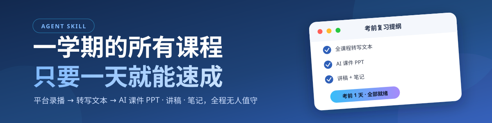

<div align="center">
  
</div>

<div align="center">

# 🎓 skipping-lectures

### 把一学期的录播课，变成考前一天的复习提纲。

一个可安装到 opencode、Claude Code、Codex 等 Agent 的录播课学习流水线 Skill——
平台录播转文本，网盘视频出 PPT，全程无人值守。

[](https://github.com/jing1312/skipping-lectures/actions/workflows/validate.yml)
[](LICENSE)

</div>

## 🎯 它解决什么

如果你上过有录播的课，大概率经历过这些：

- **看不过来**：一学期 153 节录播、13GB 视频，课上都听不完，更别说回看。
- **找不着重点**：老师课上强调的内容几乎都考，但复习时要在几小时视频里翻。
- **手动点到手软**：网盘 AI 能出课件 PPT/讲稿/笔记，但一节一节手动触发导出，153 节要一整天。
- **下载拦路**：平台视频是签名直链，到期就 401/403，本地空间也不够全下。

**这个 skill 让 Agent 替你干完这些**：录播 → 转写文本 → 提炼重点 → AI 课件 PPT / 讲稿 / 笔记，你要的是一页纸，不是几十小时视频。

## ✅ 已经跑通（不是 PPT 上的方案）

> 原会话实战：**4 门专业课、153 节录播**，自动导出 **146 份 AI 课件 PPT、122 份讲稿、
> 55+ 份笔记**，全程无人值守；另有一条完整转写链路，每节课一份带时间戳的文本——
> 考前 1–2 天，一门课就能备好。

## ✨ 它好在哪

- **两条路线，互不打架**：平台录播走「抽音频 → 转写」拿文本（省空间）；网盘视频走「网盘 AI」拿 PPT/讲稿/笔记。文本和 PPT 可以都做。
- **不占本地空间**：153 节 13GB 的视频，只留每节不到 100MB 的音频 + 一份文本。
- **跑批挂机，断点续传**：中断了只补没完成的，不用从头再来；失败的单节自动跳过，事后重跑。
- **坑都替你踩过**：直链过期自动重刷、AI 生成失败识别占位模板（不会留空壳文件）、页面改版有探测思路而不是瞎猜。
- **一次建成，长期复用**：每个学期、每门课，说一句话就重新跑一遍。
- **不上课 ≠ 摆烂**：录播是完整信息源，文本化学习效率更高——把时间留给深度思考和创造。

## 🖥️ 能力范围

| 路线 | 覆盖 | 产出 |
|---|---|---|
| **A 转写为主** | 教学平台（香樟云课堂 zbkt.ncu.edu.cn 等）课程实录 → 列表 → 直链 → 抽音频 → 火山/MiMo ASR | 每节课一份带时间戳的 txt |
| **B 网盘 AI 产出** | 百度网盘视频 → AI 课件/讲稿/笔记批量生成与导出（Node 版 + 油猴版） | PPT（存网盘）、讲稿/笔记（本地 TXT） |

## ⚡ 快速开始

```text
1. 安装（见下，一句话的事）
2. 对 Agent 说：把「临床药理学」的课程录播整理成文本
3. 等它跑完：每节课一份 txt，直接丢给任意 LLM 提问或总结
```

想拿 PPT 就多说一句：「顺便把网盘里的课批量导出课件」。Skill 会先问清视频在哪、要什么产出，再自动执行。

## 🚀 安装

### 方式一：把这句话交给 Agent（最适合新手）

```text
请安装这个 Agent Skill：https://github.com/jing1312/skipping-lectures
先审查仓库内容和 SKILL.md，再安装到你当前 Agent 的 Skills 目录；如果已经安装旧版本，先备份再更新。
完成后告诉我实际安装路径、目标 Agent 和验证结果。
```

<details>
<summary>方式二：仓库安装器（可控制路径）</summary>

```bash
git clone https://github.com/jing1312/skipping-lectures.git
cd skipping-lectures
```

Windows PowerShell：

```powershell
.\scripts\install.ps1 -Target agents          # ~/.agents/skills（opencode 等）
.\scripts\install.ps1 -Target claude          # ~/.claude/skills
.\scripts\install.ps1 -Target codex           # ~/.codex/skills
.\scripts\install.ps1 -Target custom -Destination "D:\path\to\skills"
```

macOS / Linux：

```bash
./scripts/install.sh --target agents
./scripts/install.sh --target claude
./scripts/install.sh --target codex
./scripts/install.sh --target custom --destination "/path/to/skills"
```

目标目录已存在时默认拒绝覆盖；升级时显式加 `-Force` / `--force`，旧版本先备份到
`external/skipping-lectures/backups`，失败自动回滚。

</details>

<details>
<summary>方式三：手动复制</summary>

把 [`skills/skipping-lectures`](skills/skipping-lectures) 整个目录复制到 Agent 的 Skills 根目录：

```text
~/.agents/skills/skipping-lectures/
~/.claude/skills/skipping-lectures/
~/.codex/skills/skipping-lectures/
```

必须保留 `SKILL.md` 和 `references/`，不要只复制某一个文件。重启会话即可触发。

</details>

## 🧭 你能这样用

| 场景 | 你可以这样问 |
|---|---|
| 整理课程录播 | “把临床药理学的录播整理成文本，先看一下有多少节。” |
| 导出课件 PPT | “网盘里这学期课程的视频，帮我批量导出 AI 课件 PPT。” |
| 提炼课程重点 | “把《药物分析》的转写文本合并后提炼重点，做成复习提纲。” |
| 考前突击 | “明天考生物药剂，把这门课的笔记和讲稿整理成一页纸。” |
| 直链失效 | “抽音频报 401，帮我刷新直链后继续，别从头跑。” |

标准工作顺序：确认目标 → 环境检查 → 分步执行（每步告诉你进度）→ 验证产物 → 收尾汇报。

## 🛡️ 安全边界

- 密钥（火山 `VOLC_*`、MiMo `MIMO_API_KEY` 等）只走环境变量或 gitignore 的 `config.json`，绝不写进仓库或提交——所有仓库都是公开的。
- 不把平台 Cookie / 登录凭证写入代码、日志或文档。
- 只操作用户明确要求处理的课程/视频；不批量触碰无关数据。

## ❓ 常见问题

**视频必须留在本地吗？**

不用。路线 A 只抽音频；路线 B 视频进网盘后本地可删。

**百度网盘离线下载不好使怎么办？**

平台视频是内网地址（`*.ncu.edu.cn`），网盘离线下载不保证可用——改成「本地下载 → 改名 → 上传网盘 → 本地删」。

**页面改版了脚本还能用吗？**

两仓库都是实测得出的 DOM/接口逻辑，改版就失效。skill 里记录了探测思路（CDP 看 Vue 组件、抓接口），按思路重新适配即可，不用重写。

**它只适用于学校平台吗？**

当前是。但「视频 → 文本/PPT」的骨架是通用的——B 站课程、纪录片、培训录像，任何有录播的地方都能套（新平台 = 加一个 playbook）。

## 🧱 项目结构

<details>
<summary>点击展开</summary>

```text
skills/skipping-lectures/
├── SKILL.md                 # 触发描述 + 强制工作流 + 安全策略
├── test-prompts.json        # 3 个真实场景回归测试
└── references/              # 按需加载的 Playbook（索引路由）
    ├── route-index.md       # 路由表：场景 → playbook
    ├── route-a-transcribe.md
    ├── route-b-pan-export.md
    ├── cdp-login.md
    └── troubleshooting.md
assets/
└── skipping-lectures-cover.svg  # README 封面图
scripts/
├── install.ps1              # Windows 安装器
└── install.sh               # macOS/Linux 安装器
tests/validate_skill.py      # 无第三方依赖的仓库验证器（CI 自动跑）
```

</details>

## 🧪 开发与验证

<details>
<summary>点击展开</summary>

```powershell
python tests\validate_skill.py
```

验证器检查 frontmatter、description 长度、references 索引一致性、test-prompts.json
合法性、占位符、疑似凭据和危险 shell 管道。GitHub Actions 每次 push 自动重复验证，
并测试安装器的首次安装、拒绝覆盖、备份和强制更新路径。

修改后可用 `test-prompts.json` 做回归：让 Agent 按 prompt 执行，检查是否命中预期流程。

</details>

## 🚀 这不是一次性脚本

- **每学期复用**：开学说一句话，学期末自动拥有一整套复习资料。
- **跨场景复制**：视频 → 知识的骨架通用，换平台只加 playbook。
- **随 AI 一起进化**：评估 → 改进 → 测试 → 保留（CI + test-prompts 保证改不坏）。
- 老师课上强调的内容 ≈ 考点，录播是完整信息源——让「不上课」成为可行选择，
  把省下的时间留给真正重要的东西。

## 📄 来源与许可证

项目按 [MIT](LICENSE) 分发。实际工作由两个公开仓库完成：
[xiangzhang-course-pipeline](https://github.com/jing1312/xiangzhang-course-pipeline)（平台录播 → 转写）与
[baidu-ai-batch](https://github.com/jing1312/baidu-ai-batch)（网盘 AI 批量导出），本 skill 是它们的编排层。

欢迎提交经过验证的流程改进、新平台适配和实战案例。
